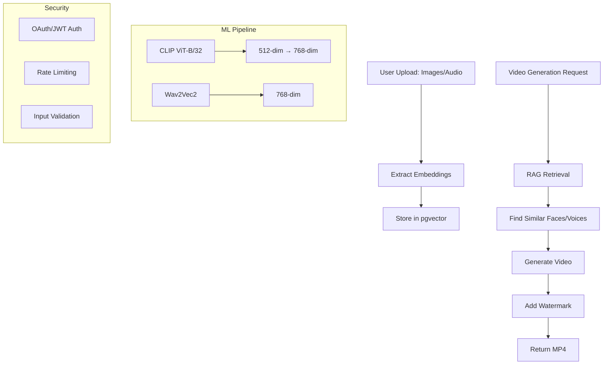

# Multi-Modal RAG System for AI Video Generation

> **Advanced RAG Architecture Extended for Images and Audio**

This implementation extends Apex Intelligence's text-based RAG system to support multi-modal inputs (images and audio) for personalized AI video generation. It uses CLIP for image embeddings, Wav2Vec2 for audio embeddings, and pgvector for hybrid search.

## 🎯 Features

- **Multi-Modal Embeddings**: Support for both image (CLIP) and audio (Wav2Vec2) embeddings
- **Hybrid Search**: Vector similarity search with pgvector for finding similar faces/voices
- **RAG-based Retrieval**: Semantic search for personalized video generation
- **Secure API**: JWT authentication, rate limiting, input validation
- **Ethical Safeguards**: Watermarks, disclaimers, usage logging
- **Scalable Architecture**: Ready for serverless deployment on Vercel

## 📐 Architecture



## 🗄️ Database Schema

### Multi-Modal Embeddings Table

```typescript
multiModalEmbeddings {
  id: uuid
  userId: string (FK -> users.id)
  type: 'image' | 'audio'
  embedding: vector(768)  // pgvector
  fileUrl: string         // S3/R2 URL
  metadata: jsonb {
    filename, fileSize, mimeType,
    faceLandmarks, emotionScores, voiceCharacteristics
  }
  createdAt: timestamp
  updatedAt: timestamp
}
```

### Video Generation Requests Table

```typescript
videoGenerationRequests {
  id: uuid
  userId: string (FK -> users.id)
  script: string
  setting: string
  duration: integer
  status: 'pending' | 'processing' | 'completed' | 'failed'
  outputUrl: string
  retrievalMetadata: jsonb {
    imageEmbeddingIds, audioEmbeddingIds, similarityScores
  }
  processingStartedAt: timestamp
  processingCompletedAt: timestamp
  errorMessage: string
  createdAt: timestamp
  updatedAt: timestamp
}
```

## 🔌 API Endpoints

### 1. Upload Image/Audio

**POST** `/api/multi-modal/upload`

Upload images or audio files for embedding extraction.

**Request (multipart/form-data):**
```bash
curl -X POST http://localhost:3000/api/multi-modal/upload \
  -H "Authorization: Bearer YOUR_JWT_TOKEN" \
  -F "file=@face.jpg" \
  -F "type=image"
```

**Response:**
```json
{
  "success": true,
  "id": "uuid",
  "type": "image",
  "filename": "face.jpg"
}
```

**Rate Limit:** 5 uploads per hour

**File Constraints:**
- Images: JPEG, PNG, WebP (max 10MB)
- Audio: WAV, MP3, OGG (max 10MB)

### 2. Generate Video

**POST** `/api/multi-modal/generate-video`

Generate AI video using RAG-retrieved embeddings.

**Request:**
```bash
curl -X POST http://localhost:3000/api/multi-modal/generate-video \
  -H "Authorization: Bearer YOUR_JWT_TOKEN" \
  -H "Content-Type: application/json" \
  -d '{
    "script": "Hello, this is my AI twin talking about TCG markets",
    "setting": "cyberpunk",
    "duration": 15
  }'
```

**Response:**
```json
{
  "success": true,
  "requestId": "uuid",
  "status": "completed",
  "videoUrl": "/api/multi-modal/video/uuid",
  "message": "Video generated successfully"
}
```

**Rate Limit:** 3 generations per day

**Constraints:**
- Script: 10-500 characters
- Duration: 5-30 seconds
- Setting: alphanumeric + spaces/hyphens

### 3. Check Video Status

**GET** `/api/multi-modal/generate-video?requestId=uuid`

Check the status of a video generation request.

**Response:**
```json
{
  "success": true,
  "requestId": "uuid",
  "status": "completed",
  "videoUrl": "/api/multi-modal/video/uuid",
  "createdAt": "2025-11-22T10:00:00Z",
  "processingStartedAt": "2025-11-22T10:00:01Z",
  "processingCompletedAt": "2025-11-22T10:00:15Z"
}
```

### 4. Download Video

**GET** `/api/multi-modal/video/[id]`

Download the generated video file.

**Response:** MP4 video file with watermark

## 🛠️ Setup & Installation

### 1. Install Dependencies

```bash
# Node.js dependencies (already in package.json)
pnpm install

# Python ML dependencies
pip3 install -r apps/web/ml-requirements.txt
```

### 2. Environment Variables

Add to `.env.local`:

```bash
# Existing vars
DATABASE_URL=postgres://...
REDIS_URL=redis://...
JWT_SECRET=...

# Optional: For production video generation
AWS_S3_BUCKET=...
AWS_ACCESS_KEY_ID=...
AWS_SECRET_ACCESS_KEY=...
```

### 3. Database Migration

```bash
# Generate migration
pnpm db:generate

# Apply migration
pnpm db:migrate
```

The migration will:
- Create `multi_modal_embeddings` table with pgvector
- Create `video_generation_requests` table
- Add HNSW indexes for fast vector search

### 4. Verify Python Setup

```bash
python3 -c "
import torch
import transformers
from PIL import Image
import librosa
print('All dependencies installed!')
"
```

### 5. Start Development Server

```bash
pnpm dev:web
```

## 📊 RAG Search Functions

### Vector Similarity Search

```typescript
import { multiModalVectorSearch } from '@/rag/multi-modal';

// Search for similar images
const results = await multiModalVectorSearch(queryEmbedding, {
  userId: 'user-id',
  type: 'image',
  limit: 5,
  minSimilarity: 0.7,
});
```

### Hybrid Multi-Modal Search

```typescript
import { hybridMultiModalSearch } from '@/rag/multi-modal';

// Combine image and audio search
const { images, audio, combined } = await hybridMultiModalSearch(
  imageEmbedding,
  audioEmbedding,
  'user-id',
  { image: 0.6, audio: 0.4 }
);
```

### Find Similar Faces

```typescript
import { findSimilarFaces } from '@/rag/multi-modal';

// Find faces similar to reference
const faces = await findSimilarFaces(referenceEmbedding, 'user-id', 5);
```

### Find Similar Voices

```typescript
import { findSimilarVoices } from '@/rag/multi-modal';

// Find voices similar to reference
const voices = await findSimilarVoices(referenceEmbedding, 'user-id', 5);
```

## 🧪 Testing

### 1. Test Upload

```bash
# Upload test image
curl -X POST http://localhost:3000/api/multi-modal/upload \
  -H "Authorization: Bearer $TOKEN" \
  -F "file=@test-face.jpg" \
  -F "type=image"

# Upload test audio
curl -X POST http://localhost:3000/api/multi-modal/upload \
  -H "Authorization: Bearer $TOKEN" \
  -F "file=@test-voice.wav" \
  -F "type=audio"
```

### 2. Test Video Generation

```bash
# Generate video
curl -X POST http://localhost:3000/api/multi-modal/generate-video \
  -H "Authorization: Bearer $TOKEN" \
  -H "Content-Type: application/json" \
  -d '{
    "script": "Testing AI video generation with multi-modal RAG",
    "setting": "professional",
    "duration": 10
  }'
```

### 3. Check Dependencies

```bash
# Check Python ML dependencies
curl http://localhost:3000/api/multi-modal/health
```

## 🚀 Production Deployment

### Vercel Deployment

1. **Push to GitHub:**
   ```bash
   git add .
   git commit -m "feat: Add multi-modal RAG for video generation"
   git push origin claude/multimodal-rag-clip-01AQbjUMYYdtVK6jAxTTySqD
   ```

2. **Configure Vercel:**
   - Connect GitHub repository
   - Add environment variables
   - Enable pgvector extension in Vercel Postgres

3. **Optional GPU Setup:**
   - For heavy ML inference, integrate with RunPod or Replicate
   - Replace Python bridge with API calls

### Performance Optimization

- **Embedding Extraction**: Use Replicate API instead of local Python
- **Video Generation**: Queue jobs with BullMQ for async processing
- **File Storage**: Upload to S3/R2 instead of local filesystem
- **Caching**: Cache embeddings in Redis for faster retrieval

## ⚖️ Trade-offs & Considerations

### Latency vs Quality

- **Current**: Local Python execution (~2-5s per embedding)
- **Production**: Use Replicate/HF Inference API (~1-2s)
- **Video Gen**: Placeholder uses FFmpeg (~5s), real models take 30-60s

### Cost vs Scalability

- **Local Python**: Free but slow and CPU-bound
- **Replicate**: $0.0001-0.001 per embedding, scalable
- **Vercel Functions**: 10s timeout, not suitable for heavy ML
- **Recommendation**: Use dedicated GPU instances (RunPod) for video gen

### Security & Ethics

- ✅ Watermarks on all generated videos
- ✅ Rate limiting to prevent abuse
- ✅ User-specific embeddings (no cross-user leakage)
- ✅ Audit logging in database
- ⚠️ Disclaimer: "AI Generated - Personal Use Only"
- ⚠️ Cannot prevent all misuse (deepfakes, impersonation)

## 📚 Knowledge Base References

This implementation follows patterns from:

- **knowledge-02-ai-rag-architecture-v2.md**: RAG architecture extended for multi-modal
- **knowledge-05-security-oauth2-jwt.md**: OAuth PKCE authentication
- **knowledge-09-database-architecture.md**: PostgreSQL with pgvector
- **knowledge-10-api-realtime.md**: API design with rate limiting
- **knowledge-04-devops-vercel-advanced.md**: Vercel deployment

## 🐛 Troubleshooting

### Python Dependencies Not Found

```bash
# Install dependencies
pip3 install torch transformers pillow librosa

# Verify installation
python3 -c "import torch; print(torch.__version__)"
```

### FFmpeg Not Found

```bash
# macOS
brew install ffmpeg

# Ubuntu/Debian
sudo apt-get install ffmpeg

# Verify
ffmpeg -version
```

### pgvector Extension Not Enabled

```sql
-- Enable in your PostgreSQL database
CREATE EXTENSION IF NOT EXISTS vector;

-- Verify
SELECT * FROM pg_extension WHERE extname = 'vector';
```

### Rate Limit Issues

Check your Redis connection:
```bash
redis-cli ping
# Should return "PONG"
```

## 🔮 Future Enhancements

1. **Fine-Tuning Support**: Add endpoints for user-specific model fine-tuning
2. **Real-time Processing**: WebSocket API for streaming video generation
3. **Advanced Models**: Integrate EMO, Stable Video Diffusion, Coqui TTS
4. **Batch Processing**: Support batch video generation for efficiency
5. **Analytics Dashboard**: Track usage, costs, and quality metrics

## 📄 License

MIT License - See main project LICENSE file

---

**Built with ❤️ by Apex Intelligence Team**
